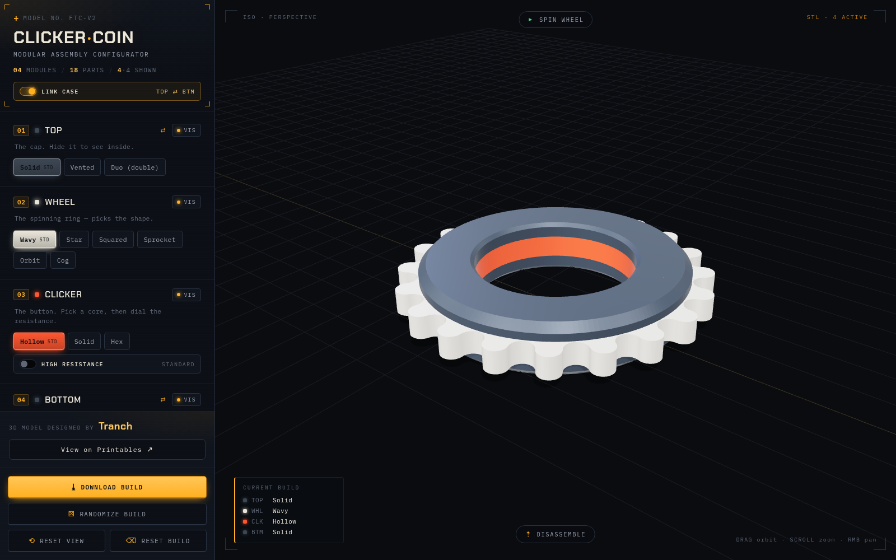

# Clicker Coin Configurator

A web-based 3D configurator for the **Fidget Toy Clicker Coin v2** — mix and
match the printable parts (top, wheel, clicker, bottom) and see them assembled
in real time before you print.



> [!IMPORTANT]
> This is an **unofficial fan-made viewer**. It does **not** include or
> redistribute any STL files. The 3D model is the work of **[Tranch]** and is
> available on Printables — see [Credits & license](#credits--license).

## What it is

The Clicker Coin is a modular print: every layer has swappable variants. This
tool lets you preview any combination in an interactive 3D scene so you can
decide what to print without slicing every option.

### Features

- **Live assembly preview** — pick a variant for each of the four slots and the
  parts snap together in their correct positions (they share one coordinate
  frame, so no manual alignment needed).
- **Top / Bottom case link** — the two case halves change as a matched set by
  default, with a toggle to mix them independently.
- **Clicker matrix** — choose a core (Hollow / Solid / Hex) and toggle
  High-Resistance separately.
- **Spin the wheel** — watch the wheel rotate around the clicker.
- **Exploded view** — tip the assembly onto its side and fan the layers out
  along a blueprint-style assembly axis, with smooth camera framing.
- **Randomize** — roll a random build (respecting the case link).
- **Download helper** — lists exactly which files your build needs, grouped by
  their Printables folder, and links you to the source to download them.

## Getting the STL files

The models aren't bundled here. Grab them first:

1. Open the model on Printables and download the archive:
   <https://www.printables.com/model/1614520-fidget-toy-clicker-coin-v2/files>
   (and consider giving it a ❤ to support the maker).
2. Drop the parts into the viewer with the helper script:

   ```bash
   mise extract ~/Downloads/fidget-toy-clicker-coin-v2.zip
   ```

   This extracts the archive, copies every `.stl` into `public/models/`,
   checks all 18 expected parts are present, and cleans up after itself.
   (You can also run `./extract.sh <zip>` directly.)

## Quick start

Requires [mise](https://mise.jdx.dev/) (which provides Bun) — or just use Bun
directly.

```bash
mise install        # install Bun via mise (the tools in mise.toml)
mise deps           # install JS dependencies
mise extract <zip>  # populate the STLs (see above)
mise dev            # start the dev server → http://localhost:5173
```

### Tasks

| Task             | What it does                                  |
| ---------------- | --------------------------------------------- |
| `mise dev`       | Start the Vite dev server                     |
| `mise build`     | Build the production bundle into `dist/`      |
| `mise test`      | Run unit tests (Vitest)                       |
| `mise typecheck` | Type-check Svelte components (`svelte-check`) |
| `mise lint`      | Check formatting (Prettier)                   |
| `mise format`    | Auto-format the codebase                      |
| `mise extract`   | Copy STLs from a downloaded Printables zip    |

## Project structure

```
.
├── extract.sh            # populate public/models from a Printables zip
├── mise.toml             # task runner + tooling
├── docs/                 # screenshots
├── tools/colors.html     # standalone palette-picker used during design
├── public/models/        # STLs land here (git-ignored, not redistributed)
└── src/
    ├── App.svelte        # control panel + HUD
    ├── app.css
    ├── main.ts
    └── lib/
        ├── Viewer.svelte # three.js scene (assembly, spin, explode)
        ├── parts.ts      # slot/variant definitions + Printables mapping
        └── parts.test.ts # data-integrity tests
```

## Tech stack

- [Svelte 5](https://svelte.dev/) (runes)
- [TypeScript](https://www.typescriptlang.org/) (strict)
- [three.js](https://threejs.org/) — WebGL rendering, `STLLoader`, `OrbitControls`
- [Vite](https://vite.dev/) — dev server & bundler
- [Bun](https://bun.sh/) — package manager & runtime
- [mise](https://mise.jdx.dev/) — task runner & tool management

## Credits & license

**3D model — “Fidget Toy Clicker Coin v2”**
Designed by **[Tranch]** and published on Printables:
<https://www.printables.com/model/1614520-fidget-toy-clicker-coin-v2>

The model is licensed **Creative Commons — Attribution–NonCommercial
([CC BY-NC 4.0])**. That means: attribution required, remixing allowed,
**no commercial use**. This project does not redistribute the STL files; it only
helps you visualize them and points you to the official source to download.

All credit for the physical design goes to Tranch. This configurator is an
independent, non-commercial tool and is not affiliated with or endorsed by the
designer.

**Configurator code** in this repository is separate from the model. If you
remix or reuse it, please keep the attribution to the original model intact.

[Tranch]: https://www.printables.com/@Tranch
[CC BY-NC 4.0]: https://creativecommons.org/licenses/by-nc/4.0/
